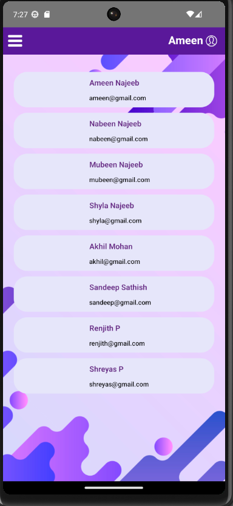

# React Native User Management App
This is a small Proof of Concept (PoC) app developed in React Native for managing user registration, login, and user details. The app is built with TypeScript and utilizes Redux for state management, async storage for data persistence, and Jest + Enzyme for automated unit testing.

## Prerequisites
Before running the app, make sure you have set up the following prerequisites:

- [Node.js](https://nodejs.org/en) installed on your machine
- [Android Studio](https://developer.android.com/studio) and [Xcode](https://developer.apple.com/xcode/) for Android and iOS development respectively

Follow the [React Native Environment Setup Guide](https://reactnative.dev/docs/environment-setup) for detailed instructions on setting up your development environment.

## Getting Started
- Clone this repository to your local machine.
- Navigate to the project directory in your terminal.
- Run npm install to install project dependencies.
- Run npx react-native run-android or npx react-native run-ios to start the development  server and launch the app on your emulator or connected device.

## App Features

### Landing Screen
- The landing screen presents options for user signup and login.

- 
### Signup Screen
- Users can enter their first name, last name, email, and password for registration.
- Email and password validation is performed.
- Upon successful validation, user details are saved to async storage.

- 
### Login Screen
- Users can enter their email and password for login.
- Validation is performed against async storage.
- Upon successful login, the user is redirected to the Home page.

- 
### Home Screen
- Displays a list of registered users fetched from async storage.
- Includes a drawer menu with an option to logout.

- 

### User Details Screen
- Displays the username and email of a selected user.
- Provides an option to update the username.

-  

### State Management
- Redux is used for state management and persistence store.
### Unit Testing
- Unit test cases are written for all relevant business use cases using Jest + Enzyme.

Click this [link](./screenshots/) to see more screenshots of the app